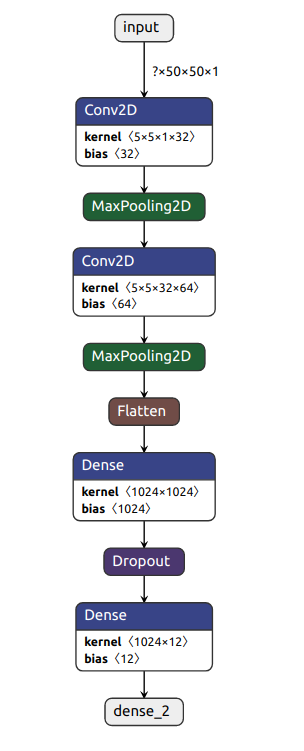

# Emojinator

### About emojinator
Emojis are ideograms and smileys used in electronic messages and web pages. Emoji exist in various genres, including facial expressions, common objects, places and types of weather, and animals. They are much like emoticons, but emoji are actual pictures instead of typographics.

### Functionalities
1. Filters to detect hand.
2. CNN for training the model.

### Python Implementation
The model is made up of a neural network consisting of 2 convolutional networks followed by 2 dense layers.

### Model Architecture



### Getting started
* Clone the repository
* Enter the directory ```Emojinator_code/```
* Run ```CreateGest.py``` to create your own dataset of gestures (stored in gestures/)
* Run ```CreateCSV.py``` to create a CSV file for the dataset containing gestures (stored as train_foo.csv)
* Run ```train_emojinator.py``` to train the classifier on the generated dataset. An ```emojinator.h5``` model is saved which will be later used for making predictions.
* Run ```emojinator.py``` to predict results

### Steps in Command Line Interface
```shell
    git clone https://github.com/shrinidhi99/Emojinator.git
    cd Emojinator_code
    python3 CreateGest.py
    python3 CreateCSV.py
    python3 train_emojinator.py
    python3 emojinator.py
```

### Preview

